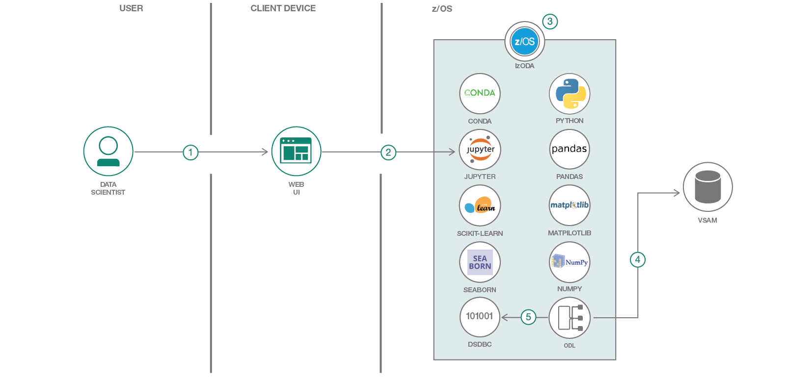

# The client retention demo

This demo is an exploratory Jupyter Notebook.  It analyzes customer data and customer credit card transactions data on the mainframe to discover potential factors for why they would leave the bank.

So let's set up the back story for this demo: You are a bank that is experiencing customer retention issues, or in data scientist terms, **customer churn**.  Now, the data science team (you) will need to analyze the data to see what features are good indicators of potential churn.

This demo is written in Python and includes many of the top Python libraries like Pandas and MatPlotLib.  It also does machine learning with Scikit-learn.



## Flow

1. A data scientist interacts with a web UI.
1. The web UI is the browser-based user interface for Jupyter Notebook.
1. Jupyter Notebook is part of IzODA, running on z/OS.
1. A VSAM dataset is accessed via a virtural table defined in Optimized Data Layer (ODL).
1. DSDBC queries ODL for the VSAM date.

## Included components

* [IzODA](https://izoda.github.io): An assembly of key open source and proprietary technologies that allow data scientists and application developers to analyze and visualize the large volumes of data hosted on IBM Z.
* [Conda](https://conda.io/docs/index.html): An open source package management system and environment management system.
* [Jupyter Notebook](http://jupyter.org/): An open source web application that allows you to create and share documents that contain live code, equations, visualizations, and explanatory text.
* [Pandas](https://pandas.pydata.org): An open source, BSD-licensed library that provides high-performance, easy-to-use data structures and data analysis tools for the Python programming language.
* [Scikit-learn](http://scikit-learn.org/stable/): A simple and efficient set of tools for data mining and data analysis.
* [MatPlotLib](https://matplotlib.org): A Python 2D plotting library that produces publication quality figures in a variety of hard-copy formats and interactive environments across platforms.
* [Seaborn](https://seaborn.pydata.org): A Python data visualization library that's based on MatPlotLib. It provides a high-level interface for drawing attractive and informative statistical graphics.
* [Numpy](http://www.numpy.org): The fundamental package for scientific computing with Python. It contains among other things:
* [DSDBC](https://anaconda.org/izoda/dsdbc)
* ODL

## Featured technologies

* [Artificial Intelligence](https://medium.com/ibm-watson): Can be applied to disparate solution spaces to deliver disruptive technologies.
* [Data Science](https://medium.com/ibm-watson): Systems and scientific methods for analyzing structured and unstructured data in order to extract knowledge and insights.
* [Python](https://www.python.org/): A programming language that lets you work more quickly and integrate your systems more effectively.

# Steps

Either run locally:

1. [Clone the repo](#1-clone-the-repo)
2. [Run Jupyter Notebook](#2-run-jupyter-notebooks)

## Run locally

### 1. Clone the repo

Clone the Client-Retention-Through-Data-Analysis-On-zOS locally. In a terminal, run:

```
$ git clone git@github.com:IBM/Client-Retention-Through-Data-Analysis-On-zOS.git
```

### 2. Run Jupyter Notebook

The code included in this code pattern runs in a Jupyter Notebook.

* Start your Jupyter Notebooks. Starting in your `Client-Retention-Through-Data-Analysis-On-zOS` cloned repo directory will help you find the notebook and the output as described below. Jupyter Notebooks will open in your browser.

   ```
   cd Client-Retention-Through-Data-Analysis-On-zOS
   jupyter notebook
   ```

* Navigate to the `notebooks` directory and open the notebook file named `credit_scoring.ipynb` by clicking on it.


# Links

* [IzODA](https://izoda.github.io)
* [Live client retention demo](https://www.youtube.com/watch?v=M_5UA7rgYgw&t=135s)


# Learn more

* **IBM Open Data Analytics for z/OS**: Read more [here](https://izoda.github.io).
* **Artificial intelligence code patterns**: Enjoyed this code pattern? Check out our other [AI code patterns](https://developer.ibm.com/code/technologies/artificial-intelligence/).
* **Data analytics code patterns**: Enjoyed this code pattern? Check out our other [data analytics code patterns](https://developer.ibm.com/code/technologies/data-science/).
* **AI and data code pattern playlist**: Bookmark our [playlist](https://www.youtube.com/playlist?list=PLzUbsvIyrNfknNewObx5N7uGZ5FKH0Fde) with all of our code pattern videos.


# License
[Apache 2.0](LICENSE)
